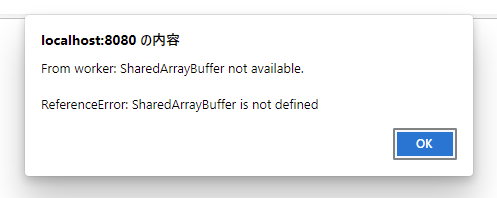

# webpack-serve-custom-headers

## Overview

We need to activate `SharedBufferArray` in Worker, in order to implement `fs.readSync` by using [Atomics.wait()](https://developer.mozilla.org/en-US/docs/Web/JavaScript/Reference/Global_Objects/Atomics/wait).

## repro

Run:

```bat
yarn serve
```

And then browse when it is ready: http://localhost:8080/

## SharedBufferArray is disabled by default on modern web browsers.

This will be popup if we need the following headers:



```
'Cross-Origin-Opener-Policy': 'same-origin',
'Cross-Origin-Embedder-Policy': 'require-corp',
```

## Workaround?

And if we include the following options in `webpack.config.js`,

```
    devServer: {
        headers: {
            // Allow to use SharedBufferArray
            'Cross-Origin-Opener-Policy': 'same-origin',
            'Cross-Origin-Embedder-Policy': 'require-corp',
        }
    }
```

It says `ConcurrentCompilationError: You ran Webpack twice. Each instance only supports a single concurrent compilation at a time.`

```bat
yarn serve

yarn run v1.22.19
$ webpack serve --mode development
<i> [webpack-dev-server] Project is running at:
<i> [webpack-dev-server] Loopback: http://localhost:8080/
<i> [webpack-dev-server] On Your Network (IPv4): http://192.168.3.3:8080/
<i> [webpack-dev-server] On Your Network (IPv6): http://[fe80::516d:ed8b:bea9:1696]:8080/
<i> [webpack-dev-server] Content not from webpack is served from 'H:\Proj\webpack-serve-custom-headers\public' directory
<e> [webpack-dev-middleware] ConcurrentCompilationError: You ran Webpack twice. Each instance only supports a single concurrent compilation at a time.
<e>     at MultiCompiler.watch (H:\Proj\webpack-serve-custom-headers\node_modules\webpack\lib\MultiCompiler.js:506:19)
<e>     at wdm (H:\Proj\webpack-serve-custom-headers\node_modules\webpack-dev-middleware\dist\index.js:254:24)
<e>     at Server.setupDevMiddleware (H:\Proj\webpack-serve-custom-headers\node_modules\webpack-dev-server\lib\Server.js:1943:23)
<e>     at Server.initialize (H:\Proj\webpack-serve-custom-headers\node_modules\webpack-dev-server\lib\Server.js:1793:10)
<e>     at Server.start (H:\Proj\webpack-serve-custom-headers\node_modules\webpack-dev-server\lib\Server.js:3206:16)
<e>     at processTicksAndRejections (internal/process/task_queues.js:95:5)
<e>     at async Command.<anonymous> (H:\Proj\webpack-serve-custom-headers\node_modules\@webpack-cli\serve\lib\index.js:257:25)
<e>     at async Promise.all (index 1)
<e>     at async Command.<anonymous> (H:\Proj\webpack-serve-custom-headers\node_modules\webpack-cli\lib\webpack-cli.js:1372:13)
<i> [webpack-dev-server] Project is running at:
```

And then 2 web servers (`http://localhost:8080/` and `http://localhost:8081/`) are launched separatedly.

```
yarn serve

yarn run v1.22.19
$ webpack serve --mode development
<i> [webpack-dev-server] Project is running at:
<i> [webpack-dev-server] Loopback: http://localhost:8080/
<i> [webpack-dev-server] On Your Network (IPv4): http://192.168.3.3:8080/
<i> [webpack-dev-server] On Your Network (IPv6): http://[fe80::516d:ed8b:bea9:1696]:8080/
<i> [webpack-dev-server] Content not from webpack is served from 'H:\Proj\webpack-serve-custom-headers\public' directory
<e> [webpack-dev-middleware] ConcurrentCompilationError: You ran Webpack twice. Each instance only supports a single concurrent compilation at a time.
<e>     at MultiCompiler.watch (H:\Proj\webpack-serve-custom-headers\node_modules\webpack\lib\MultiCompiler.js:506:19)
<e>     at wdm (H:\Proj\webpack-serve-custom-headers\node_modules\webpack-dev-middleware\dist\index.js:254:24)
<e>     at Server.setupDevMiddleware (H:\Proj\webpack-serve-custom-headers\node_modules\webpack-dev-server\lib\Server.js:1943:23)
<e>     at Server.initialize (H:\Proj\webpack-serve-custom-headers\node_modules\webpack-dev-server\lib\Server.js:1793:10)
<e>     at Server.start (H:\Proj\webpack-serve-custom-headers\node_modules\webpack-dev-server\lib\Server.js:3206:16)
<e>     at processTicksAndRejections (internal/process/task_queues.js:95:5)
<e>     at async Command.<anonymous> (H:\Proj\webpack-serve-custom-headers\node_modules\@webpack-cli\serve\lib\index.js:257:25)
<e>     at async Promise.all (index 1)
<e>     at async Command.<anonymous> (H:\Proj\webpack-serve-custom-headers\node_modules\webpack-cli\lib\webpack-cli.js:1372:13)
<i> [webpack-dev-server] Project is running at:
<i> [webpack-dev-server] Loopback: http://localhost:8081/
<i> [webpack-dev-server] On Your Network (IPv4): http://192.168.3.3:8081/
<i> [webpack-dev-server] On Your Network (IPv6): http://[fe80::516d:ed8b:bea9:1696]:8081/
<i> [webpack-dev-server] Content not from webpack is served from 'H:\Proj\webpack-serve-custom-headers\public' directory
```
